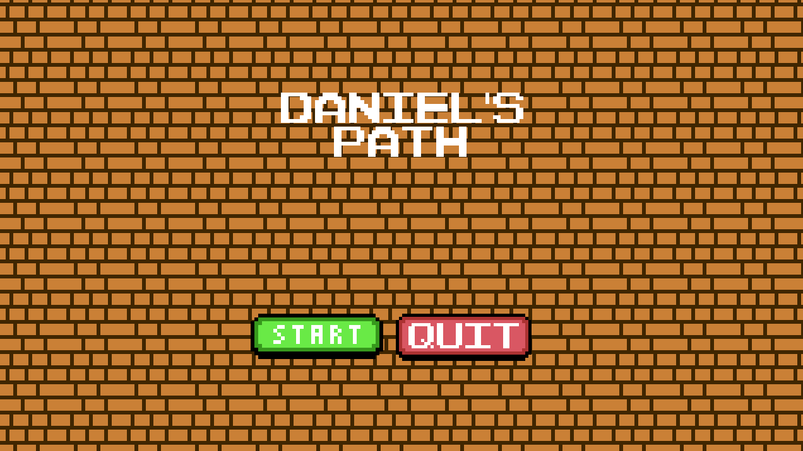
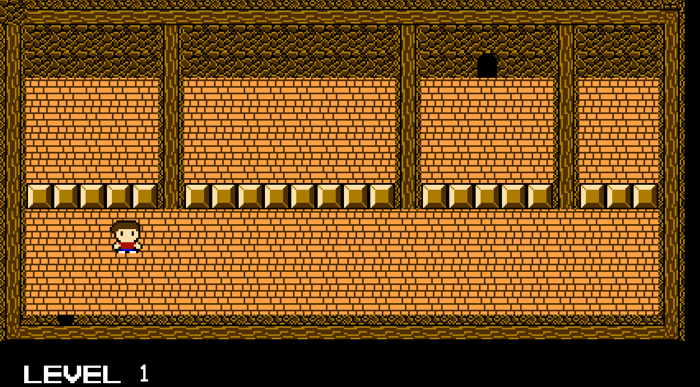

# Daniel's Path

This is a top-down puzzle game with NES-inspired graphics, where you need to move boxes to find your way out of a level.

## Dependencies
The game runs with pygame-ce. To get started, create a virtual environment and install the dependencies with the following command:

`pip install -r requirements.txt`

## Creating levels

The game is very flexible for level creation. By reading CSV files inside the folder `resources/ui/csv/levels/{level_id}`, you can hardcode a map or use software like Tiled.